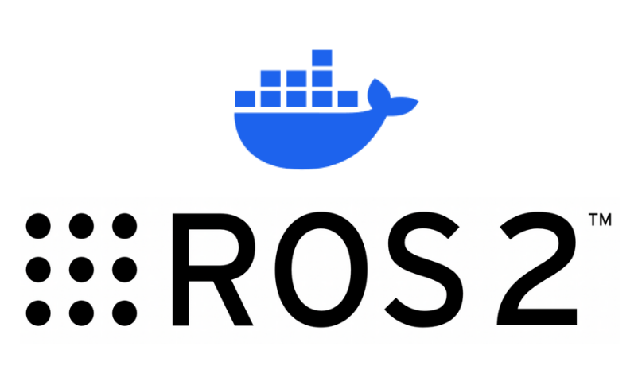
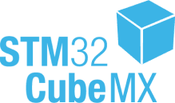

## Hi there 👋
🌱 I am currently studying ROS, large language models, IsaacLab for reinforcement learning, and their applications in robot control research.

##
**Languages and Tools:**
##

  
  
  
  
  

<!--
**ZHANG-zzt/ZHANG-zzt** is a ✨ _special_ ✨ repository because its `README.md` (this file) appears on your GitHub profile.

Here are some ideas to get you started:

- 🔭 I’m currently working on ...
- 🌱 I’m currently learning ...
- 👯 I’m looking to collaborate on ...
- 🤔 I’m looking for help with ...
- 💬 Ask me about ...
- 📫 How to reach me: ...
- 😄 Pronouns: ...
- ⚡ Fun fact: ...
-->
